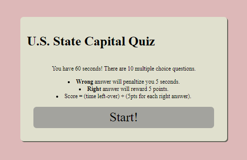

# Math Quiz! 

## Description

This is a U.S. State Capital Quiz. 
Given 60 seconds, there are 10 questions, with four multiple choice answers. A Wrong answer will penaltize you 5 seconds. Right score will reward 5 points. Score is based on timer-left-over + 5pts for each right answer.  
(Note: This form is incomplete.)

## Installation

N/A

## Usage

Let's brush up on your state capitals knowledge! 

## Credits

N/A

## License
Please refer to the LICENSE in the repo

##Links: 

github repository link: https://github.com/s0m3y3/U.S.-State-Capital-Quiz
/main

website link: https://s0m3y3.github.io/U.S.-State-Capital-Quiz/
